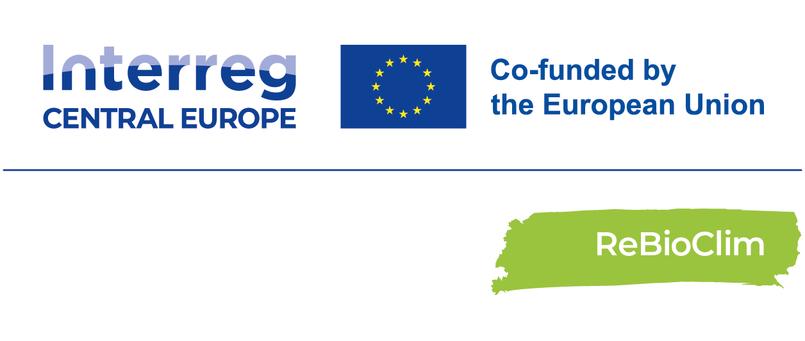
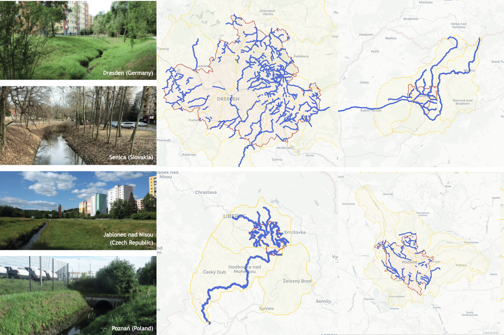
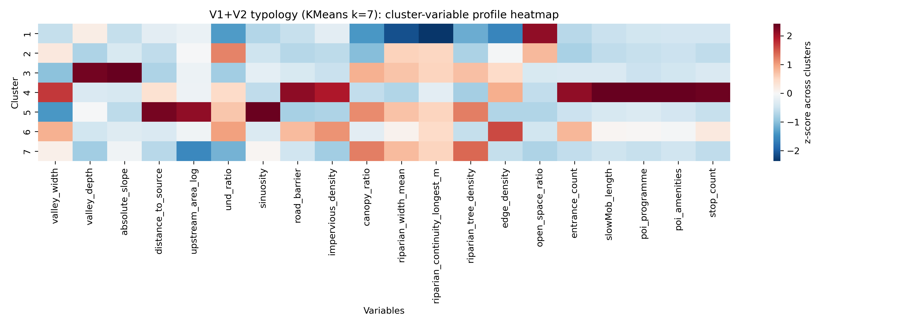
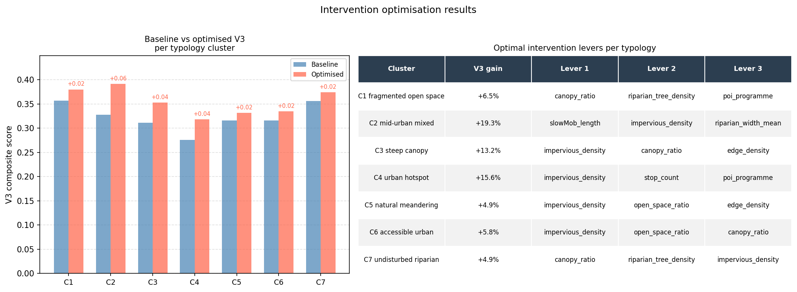
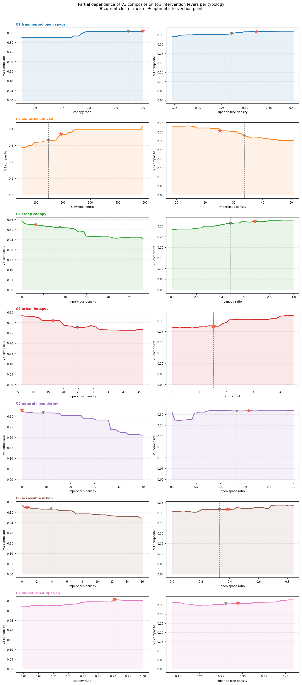

# ReBioClim urban stream spatial analysis

  

## Introduction

Urban streams are extensive yet often overlooked ecological and spatial networks in cities, but many have been degraded by channelization, culverting, and surrounding urban development, limiting their capacity to support biodiversity, mitigate urban heat, and provide accessible public spaces. In response to biodiversity loss and climate change, urban streams have growing potential as nature-based solutions, yet their restoration is constrained by fragmented, site-specific assessment methods that are difficult to standardize or scale. This study aims to develop a spatially explicit, open-data-based framework for urban stream restoration by examining how actionable variables relate to multiple outcomes, including biodiversity, climate adaptation, and quality of life, and by identifying effective interventions for different types of stream corridors.

This repository documents the **spatial analysis workflow** developed for [ReBioClim](https://www.interreg-central.eu/projects/rebioclim/) (*Restoring urban streams to promote Biodiversity, Climate adaptation and to improve quality of life in cities*), which is an EU Interreg project applied to four Central European cities. The approach uses open geospatial data (OSM, DEMs, land cover, accessibility, and related layers) to build comparable **100, 200, 400 m stream segments**, compute a structured indicator set (**V1** hydro-morphological context, **V2** actionable levers, **V3** outcomes), and group segments into **typologies** that reflect different restoration contexts.

The analysis emphasises **explainable links** between interventions and outcomes: per-typology **XGBoost** surrogate models and **SHAP** values show which levers matter where, and constrained optimisation explores realistic intervention scenarios. The code in `scripts/` is organised for reproducibility; methodological detail is in `notebook/rebioclim_workflow.qmd`.

## What this repo does

1. Stream geometry and 100 m segments (OSM, DEM).
2. Variable calculation and merge (V1, V2, V3).
3. Typology clustering and method comparison.
4. Intervention optimisation with explainable ML.

Code: `scripts/` (`01geometry` → `02variable` → `03analysis` → `04visual`).

## Steps

### 1. Analytical workflow

From stream geometry and variables to typology-based intervention analysis.

### 2. Stream network (four cities)

Spatial extent of the urban stream networks used in the case studies.

### 3. Typology

Profiles of typology clusters derived from V1 and V2 variables (context and levers).

### 4. Intervention optimisation

Baseline vs optimised composite V3 performance and recommended intervention levers by typology.

### 5. Partial dependence by typology

How the composite V3 score responds to the top intervention variables in each typology.

---

## Funding

**Interreg CENTRAL EUROPE 2021–2027 CE0200754 ReBioClim** funded by the European Union.

## License

[MIT License](LICENSE).

## Citation

See [CITATION.cff](CITATION.cff).

## Contact

Yehan Wu, Claudiu Forgaci — Delft University of Technology (ReBioClim). Issues: [GitHub Issues](https://github.com/ReBioClim/SpatialAnalysis/issues).
