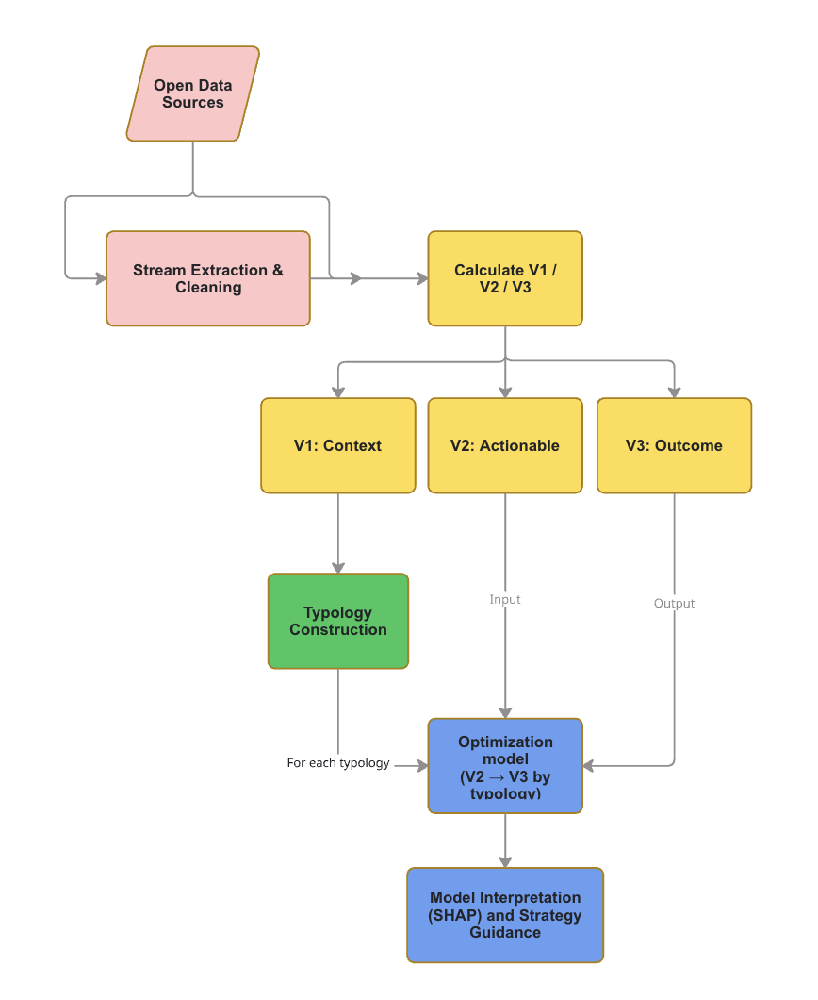

# Abstract

# 1. Introduction

Urban streams form extensive yet often overlooked ecological and spatial networks within cities. Despite their widespread presence, many urban streams are heavily modified through channelization, culverting, and surrounding urban development, resulting in degraded ecological conditions and limited social functionality. These transformations reduce their capacity to support biodiversity, mitigate urban heat, and provide accessible public spaces.

In the context of increasing environmental challenges, including biodiversity loss and climate change, urban streams have the potential to function as nature-based solutions that simultaneously enhance ecological performance and improve urban livability. However, their restoration and management remain constrained by fragmented assessment approaches. Existing evaluations are typically based on site-specific field surveys, which are time-consuming, difficult to standardize, and not scalable to large urban stream networks.

Recent advances in open geospatial data offer new opportunities to assess urban stream conditions at scale. Nevertheless, most existing studies focus on descriptive assessments or composite indices (Ranta et al., 2021; Lespez et al., 2025), which often obscure underlying mechanisms and provide limited guidance for practical interventions. There remains a lack of systematic frameworks that can both identify restoration needs and translate spatial analysis into actionable planning strategies.

This study aims to develop a spatially explicit, open-data-based framework to support urban stream restoration. Specifically, it addresses the key question: for different types of stream corridors, what types of interventions are most effective to improve biodiversity, climate adaptation, and quality of life?

Rather than relying on a single composite index, this study emphasizes the relationships between actionable variables and multiple outcome indicators. By doing so, it seeks to provide interpretable and practice-oriented guidance for optimizing restoration measures in urban stream corridors.

# 2. Methods

## 2.1 Workflow Overview

The workflow contains following stages:

1.  Stream geometry cleaning and segmentation.
2.  Variable calculation (V1, V2, V3).
3.  Merge all variables to 100m segment level.
4.  Clustering and interpretation.
5.  Relate V2 and V3 for each cluster to find the most effective interventions.

The complete workflow is implemented in the [`notebook/rebioclim_workflow.qmd`](notebook/rebioclim_workflow.qmd) notebook.

{Workflow of the analytical framework}

## 2.2 Variable System

| Variable | Definition | Scale (m) | Rationale | Source |
|----|----|----|----|----|
| **V1** |  |  |  |  |
| slope | Absolute longitudinal slope: elevation difference between segment endpoints divided by segment length, derived from DTM. | 200/- | Even under similar climatic conditions, different stream morphologies result from differences in channel slope, drainage area, and rainfall intensity (Gregory et al., 1992; Xia et al., 2010). Topography and its derivatives are key for characterising spatial heterogeneity and abiotic environments (Amatulli et al., 2018). | Amatulli et al., 2018; Niezgoda & Johnson, 2005 |
| valley_width | Mean valley width sampled at cross-sections of 200m segments, measured from valley polygons derived via RCrisp and DTM. | 200/- | Reflects valley geometry and lateral confinement; valley side slope length and angle are key controls on flood capacity and habitat diversity (Xia et al., 2010). | Xia et al., 2010 |
| valley_depth | Mean valley depth (top–bottom elevation difference) sampled at cross-sections of 200m segments. | 200/- | Reflects incision depth and vertical confinement; deeper valleys indicate greater entrenchment and reduced lateral floodplain connectivity (Xia et al., 2010). | Xia et al., 2010 |
| distance_to_source | Along-network cumulative distance from segment midpoint to stream source, calculated from mouth direction. | 200/- | Reflects longitudinal position in the river network; widely used to represent downstream gradients in hydrological, geomorphological, and ecological processes (Benda et al., 2004). | Doretto et al., 2020; Benda et al., 2004 |
| upstream_area | Upstream catchment area derived from DTM flow accumulation (pysheds, D8); log-transformed value (upstream_area_log) used in analysis. | 200/- | A fundamental control on discharge and scaling relationships, modulating the effects of urbanization along the river network (Leopold & Maddock, 1953; Paul & Meyer, 2001). | Paul & Meyer, 2001; Bartos, 2020 |
| road_barrier | Weighted transport barrier index: sum of intersecting road and railway segment lengths × class weight within a 200m buffer around the stream. | 200/200 | Road infrastructure is a proxy for lateral disconnection from floodplains and longitudinal loss of connectivity at stream intersections, in particular culverts (Grill et al., 2019). | Grill et al., 2019 |
| underground_ratio | Proportion of stream length tagged as culvert or underground within the 200m segment, derived from OSM. | 200/- | Structural openness of the stream corridor; higher ratio indicates greater channelisation and loss of ecological function (Lespez et al., 2025). | Lespez et al., 2025 |
| sinuosity | Ratio of channel line length to straight-line endpoint distance, calculated per 200m segment. | 200/- | Reflects channel naturalness and flow dynamics; higher sinuosity indicates greater morphological complexity and habitat potential (Rosgen, 1994; Niezgoda & Johnson, 2005). | Lespez et al., 2025; Xia et al., 2010; Rosgen, 1994 |
| **V2** |  |  |  |  |
| impervious_cover | Proportion of impervious surface pixels within a 100m buffer around each 100m segment, from impervious raster. | 100/100 | Reach-scale impervious cover is a better predictor of biotic condition than regional land use (Schiff & Benoit, 2007); reduces infiltration and amplifies runoff. | Schiff & Benoit, 2007; Sharma & Khanal, 2024 |
| canopy_cover | Proportion of tree canopy pixels within a 50m buffer around each 100m segment, from high-resolution canopy raster. | 100/50 | Shading helps regulate water temperature and limit eutrophication, although excessive shading in small streams may reduce photosynthetic biomass production (Burrell et al., 2014). | Burrell et al., 2014; Ranta et al., 2021 |
| riparian_width | Mean width of NDVI-based riparian vegetation corridor, sampled as lateral extent of vegetation above threshold within a 10m buffer. | 100/10 | Width of the riparian buffer is a key structural indicator of ecological function, filtering capacity, and lateral connectivity (Pace et al., 2022; Hislop et al., 2025). | Pace et al., 2022; Hislop et al., 2025 |
| riparian_continuity | Length of uninterrupted riparian vegetation patch along stream corridor, averaged across both sides. | 100/10 | Structural continuity of the riparian buffer; % of riparian corridor with no vegetation cuts along both margins influences the corridor's effectiveness as ecological infrastructure (Lespez et al., 2025). | Lespez et al., 2025; Ranta et al., 2021; Xia et al., 2010 |
| riparian_tree_density | Mean tree canopy cover density (TCD 2023) within a 10m riparian buffer, normalised to 0–1 scale. | 100/10 | Immediate riparian tree cover is a direct indicator of shade provision, root bank stabilisation, and allochthonous organic matter input (Lespez et al., 2025). | Lespez et al., 2025 |
| edge_density | Total perimeter of green land-cover patches (ESA classes: tree, shrub, grass, wetland) divided by buffer area (m/ha) within a 150m buffer. | 100/150 | Higher edge density indicates greater landscape fragmentation; reducing fragmentation through green space consolidation is a direct intervention lever for improving ecological corridor function (Finizio et al., 2024; Jaeger, 2000). | Finizio et al., 2024; Jaeger, 2000 |
| open_space_ratio | Ratio of open/lightly used land cover area (ESA classes: grassland, shrubland, bare) to total buffer area within 100m buffer. | 100/100 | Reflects surrounding land-use permeability and spatial opportunity for ecological intervention or naturalisation near the stream (Lespez et al., 2025). | Lespez et al., 2025 |
| entrance_count | Count of distinct stream entry points per 400m segment, derived from road–stream intersections clustered spatially (DBSCAN, eps=15m). | 400/- | Physical access points are a prerequisite for public use of and connection to the waterway corridor (Lespez et al., 2025). | Lespez et al., 2025 |
| slowmob_length | Total length (m) of slow-mobility paths (footway, cycleway, path, pedestrian) within a 400m buffer around each 400m segment. | 400/400 | Slow-mobility infrastructure (pedestrian/bike paths) directly enables non-motorised access to and along the stream corridor (Lespez et al., 2025). | Lespez et al., 2025 |
| poi_amenities | Count of small public amenities (benches, picnic tables, playgrounds, shelters) within a 400m buffer around each 400m segment. | 400/400 | Presence of amenities supports informal use and dwell time along the stream corridor, enhancing experiential quality (Lespez et al., 2025). | Lespez et al., 2025 |
| poi_programme | Count of programmed facilities (education, sports, culture, food, civic uses) within a 400m buffer around each 400m segment. | 400/400 | Programmatic richness of the catchment area supports diverse and sustained public use patterns along the stream (Lespez et al., 2025). | Lespez et al., 2025 |
| stop_count | Count of public transport stops within a 400m buffer around each 400m segment. | 400/400 | Transit access to stream corridors determines which populations can reach and use them, relevant for equitable access. |  |
| **V3** |  |  |  |  |
| *V3a. Biodiversity* |  |  |  |  |
| habitat_quality | Mean InVEST Habitat Quality score within a 100m riparian mask, derived from ESA land cover and habitat threat layers. | 100/- | Integrative outcome indicator for biodiversity-supporting conditions; estimates the relative degradation extent and status of different habitat types in a given region (Aznarez et al., 2022). | InVEST v.3.8.9; Aznarez et al., 2022 |
| shannon | Shannon diversity index of land-cover classes (ESA) within a 150m buffer. | 100/150 | Land-cover diversity as a biodiversity outcome; higher diversity is associated with greater habitat heterogeneity and species richness potential in riparian environments (Finizio et al., 2024; Aznarez et al., 2022). | Finizio et al., 2024; Aznarez et al., 2022; Lind et al., 2019; Graziano et al., 2022 |
| ndvi | Mean and SD of NDVI within a 50m riparian buffer, derived from GEE-exported satellite imagery. | 100/50 | Vegetation greenness and vigour as a biodiversity outcome; higher NDVI reflects greater photosynthetic activity and biomass, indicating healthier riparian vegetation (Finizio et al., 2024). | Finizio et al., 2024 |
| *V3b. Climate adaptation* |  |  |  |  |
| carbon_sequest | Annual riparian carbon sequestration (tC/ha/yr) derived from multi-year NDVI change (2018–2024) within a 5m riparian buffer, converted via biomass and carbon fraction proxy. | 100/5 | Proxy for carbon storage capacity of the riparian corridor; NDVI-to-biomass conversion reflects vegetation biomass accumulation over time (Ranta et al., 2021). | Ranta et al., 2021 |
| lst | Mean summer land surface temperature (°C) within a 100m buffer, from Landsat-derived LST raster (2024 summer). | 100/100 | Indicator of urban heat island intensity; blue-green stream corridors contribute to local cooling through evapotranspiration and shading (Zhou et al., 2023; Kim et al., 2008). | Zhou et al., 2023; Kim et al., 2008 |
| flooding | TBD | 100/- | Higher values indicate greater natural flood attenuation capacity; if floodplain land is available near streams, it helps prevent flood damages in constructed areas (Verol et al., 2019). | Ranta et al., 2021; Verol et al., 2019 |
| *V3c. Quality of life* |  |  |  |  |
| visibility_ratio | Proportion of a 200m buffer area around the stream covered by the isovist visibility polygon, computed per 400m segment. | 400/200 | Visual exposure of the stream corridor to surrounding areas relates to perceived presence, attractiveness, and informal surveillance (Lespez et al., 2025; Turner et al., 2001). | Lespez et al., 2025; Turner et al., 2001 |
| slowmob_access_index | Normalised gravity-weighted accessibility index to slow-mobility paths from stream entry points within 1000m network distance: sum(exp(-γ·t)), normalised. | 400/1000 network | Captures the quality of pedestrian/cycle network connectivity from the stream, supporting active travel to and along the corridor (Wolsink, 2016). | Ranta et al., 2021; Wolsink, 2016 |
| poi_access_index | Normalised gravity-weighted accessibility index to POIs from stream entry points within 1000m network distance: sum(exp(-γ·t)), normalised. | 400/1000 network | Reflects the functional richness and urban amenity supply reachable from the stream corridor, a key dimension of perceived usability. |  |
| transport_access_index | Normalised gravity-weighted accessibility index to public transport stops from stream entry points within 1000m network distance: sum(exp(-γ·t)), normalised. | 400/1000 network | Reflects transit connectivity from the stream corridor, influencing equitable access for populations without private transport. |  |

### V1 morphology? (why only use these for variables)

V1 variables represent relatively stable hydro-morphological context and structural conditions. These variables are not easily altered through local interventions and are therefore used to derive stream typology.

Stream typologies were derived using a set of variables representing relatively stable hydro-morphological and structural context conditions (V1). These variables were selected because they define the underlying physical and spatial constraints within which stream corridor interventions take place, and are not easily altered through typical local-scale restoration or design actions. Specifically, variables such as slope, valley geometry (width and depth), upstream position, channel sinuosity, and structural modification indicators (e.g., transport barrier intensity and underground ratio) capture key dimensions of geomorphological setting, spatial confinement, and infrastructure-induced fragmentation.

By focusing on these context variables, the resulting typology reflects differences in baseline environmental and structural conditions rather than differences in current management or intervention status. This allows the typology to serve as a stable classification of stream corridor contexts, within which the effectiveness and relevance of intervention levers (V2) can be compared and interpreted. In this way, the typology is not intended to directly explain outcome variation, but to structure the analysis of how different interventions perform under different spatial and environmental conditions.

absolute_slope valley_width valley_depth distance_to_source upstream_area_log sinuosity road_barrier_index underground_ratio

### V2

V2 variables represent actionable and planning-relevant attributes of the stream corridor, including ecological characteristics and accessibility-related factors.

impervious_cover canopy_cover riparian_width riparian_continuity riparian_tree_density open_space_ratio entrance_count slowmob_length poi_amenities poi_programme stop_count

### V3

V3 variables represent outcome indicators corresponding to the three primary goals of the study: biodiversity, climate adaptation, and quality of life. These indicators are derived from spatial proxies rather than direct measurements.

#### V3a biodiversity

habitat_quality habitat_heterogeneity_index (shannon_150m)

#### V3b climate adaptation

carbon_sequest lst flooding

#### V3c. quality of life

visibility_ratio slowmob_access_index poi_access_index transport_access_index

## 2.3 Clustering

KMeans clustering is performed on the merged 100m dataset. In the current manuscript version, we report a V1-only clustering run to derive hydro-morphological typology. Standardization is applied before clustering, and the final cluster assignment is joined back to the segment geometry.

## 2.4 Optimization model

For each cluster, a regression-based machine learning model (I consider usingLightGBM) is applied to quantify the contribution of individual V2 variables to different V3 outcomes. This approach enables the identification of context-dependent effects, where the effectiveness of interventions may vary across different structural conditions.

Rather than assuming uniform relationships across all stream segments, this step allows the analysis to reveal which variables act as key intervention levers within each typology.

Feature importance and SHAP values are used to interpret model results and to understand both the relative importance of variables and their directional effects on outcomes.

This modeling framework supports the translation of spatial patterns into actionable restoration guidance.

# 3. Results

## 3.1 Variable Outputs

Summary statistics of all variables are presented to provide an overview of their distributions and ranges across study areas.

(Some variables are to be deleted.)

| Variable                      | Non-null | Missing % |      Median |         Mean |
|-------------------------------|---------:|----------:|------------:|-------------:|
| absolute_slope                |     5713 |      2.94 |      0.0125 |       0.0249 |
| valley_width                  |     5713 |      2.94 |   2444.5297 |    1945.2340 |
| valley_depth                  |     5713 |      2.94 |     13.6735 |      18.3594 |
| distance_to_source            |     5713 |      2.94 |    700.0000 |    1714.6680 |
| pop_density_1km               |     4712 |     19.95 |   1001.7611 |    1358.7477 |
| upstream_area_m2              |     5713 |      2.94 | 453600.0000 | 5773533.0000 |
| upstream_area_log             |     5713 |      2.94 |     13.0250 |      12.9004 |
| und_ratio                     |     5713 |      2.94 |      0.0000 |       0.1369 |
| sinuosity                     |     5713 |      2.94 |      1.0469 |       1.0904 |
| road_barrier_index            |     5886 |      0.00 |    598.3398 |     748.1524 |
| impervious_density            |     5886 |      0.00 |      1.0293 |       7.9049 |
| canopy_ratio                  |     5886 |      0.00 |      0.5641 |       0.5434 |
| riparian_width_mean           |     5886 |      0.00 |    110.0000 |      93.9541 |
| riparian_continuity_longest_m |     5886 |      0.00 |    100.0000 |      91.9725 |
| riparian_tree_density         |     5886 |      0.00 |      0.1354 |       0.1430 |
| stop_count                    |     5194 |     11.76 |      0.0000 |       0.4948 |
| POI_count                     |     5194 |     11.76 |      7.5058 |      15.5575 |
| poi_programme                 |     5194 |     11.76 |     16.0000 |     170.9392 |
| poi_amenities                 |     5194 |     11.76 |     46.0000 |     392.0874 |
| slowMob_length                |     5194 |     11.76 |      9.3023 |      18.9064 |
| entrance_count                |     5194 |     11.76 |      3.0000 |       4.6941 |
| open_space_ratio              |     5886 |      0.00 |      0.0425 |       0.1497 |
| carbon_sequest                |     5886 |      0.00 |      0.0412 |       0.0584 |
| flooding_proxy_v3_clim        |     5462 |      7.20 |     -0.0052 |      -0.0052 |
| lst_mean_100m                 |     5778 |      1.83 |     29.3653 |      29.4599 |
| poi_access_index              |     5194 |     11.76 |      0.0193 |       0.0401 |
| transport_access_index        |     5194 |     11.76 |      0.0000 |       0.0421 |
| slowmob_access_index          |     5194 |     11.76 |      0.0163 |       0.0332 |
| visibility_ratio              |     5194 |     11.76 |      0.9441 |       0.8743 |
| ndvi_0.4_ratio                |     5567 |      5.42 |      0.1667 |       0.1839 |
| hq_mean                       |     5886 |      0.00 |      0.7902 |       0.7585 |
| landuse_intensity             |     5886 |      0.00 |      0.3484 |       0.5348 |

## 3.2 Typology Results

The clustering results reveal distinct stream typology types characterized by differences in hydro-morphological and structural conditions. Each typology represents a specific restoration context rather than a performance level. (The current version is a preliminary result for exploring next steps.)

| Cluster | Segments (n) | Basic name | Main characteristics (relative) |
|----|---:|----|----|
| 1 | 3041 | Urban Downstream Barrier Type | Higher `distance_to_source`, high `upstream_area_log`, highest `road_barrier_index`, and highest `pop_density_1km` |
| 2 | 768 | Midstream Low-Barrier Common Type | Moderate morphology, low `road_barrier_index`, low `und_ratio`, and lower `pop_density_1km` |
| 3 | 207 | Far-Downstream Meandering Type | Very high `distance_to_source` and `upstream_area_log`, highest `sinuosity`, and moderate barrier intensity |
| 4 | 754 | Underground-Corridor Type | Highest `und_ratio`, moderate barrier intensity, moderate-high `pop_density_1km`, and relatively low slope |
| 5 | 943 | Steep Headwater Type | Highest `absolute_slope`, shorter `distance_to_source`, and moderate `road_barrier_index` |
| -1 | 173 | Unclassified (Missing Context) | Missing one or more V1 context fields, mainly parent-scale variables from upstream mapping |

## 3.3 Intervention Effectiveness

Global and typology-specific analyses are conducted to identify key intervention variables influencing different outcome indicators.

At the global level, feature importance analysis highlights the most influential variables across all stream segments.

At the typology level, the effects of V2 variables on V3 outcomes vary across different clusters, indicating context-dependent intervention effectiveness.

This step can show the value of developing typology.

### Typology 1

### Typology 2

### Typology 3

### Typology 4

### Typology 5

# 4. Discussion

## 4.1 Recommended restoration strategies for each typology

## 4.2 Planning Implications

## 4.3 Limitations and Future Work

# 5. Conclusion

# References

Amatulli, G., Domisch, S., Tuanmu, M. N., Parmentier, B., Ranipeta, A., Malczyk, J., & Jetz, W. (2018). A suite of global, cross-scale topographic variables for environmental and biodiversity modeling. *Scientific data*, *5*(1), 180040.

Aznarez, C., Svenning, J. C., Taveira, G., Baró, F., & Pascual, U. (2022). Wildness and habitat quality drive spatial patterns of urban biodiversity. *Landscape and Urban Planning*, *228*, 104570.

@misc{bartos_2020, title = {pysheds: simple and fast watershed delineation in python}, author = {Bartos, Matt}, url = {<https://github.com/mdbartos/pysheds%7D,> year = {2020}, doi = {10.5281/zenodo.3822494} }

Benda, L. E. E., Poff, N. L., Miller, D., Dunne, T., Reeves, G., Pess, G., & Pollock, M. (2004). The network dynamics hypothesis: how channel networks structure riverine habitats. *BioScience*, *54*(5), 413-427.

Doretto, A., Piano, E., & Larson, C. E. (2020). The River Continuum Concept: lessons from the past and perspectives for the future. *Canadian Journal of Fisheries and Aquatic Sciences*, *77*(11), 1853-1864.

Finizio, M., Pontieri, F., Bottaro, C., Di Febbraro, M., Innangi, M., Sona, G., & Carranza, M. L. (2024). Remote sensing for urban biodiversity: A review and meta-analysis. *Remote Sensing*, *16*(23), 4483.

Lespez, L., Germaine, M. A., Gob, F., Tales, E., Thommeret, N., de Milleville, L., ... & Letourneur, M. (2025). A new tool to characterise the socio-environmental dimensions of urban rivers: Urban river socio-environmental index. *Landscape and Urban Planning*, *261*, 105388.

Niezgoda, S. L., & Johnson, P. A. (2005). Improving the urban stream restoration effort: identifying critical form and processes relationships. *Environmental management*, *35*(5), 579-592.

Ranta, E., Vidal-Abarca, M. R., Calapez, A. R., & Feio, M. J. (2021). Urban stream assessment system (UsAs): An integrative tool to assess biodiversity, ecosystem functions and services. *Ecological Indicators*, *121*, 106980.

Rosgen, D. L. (1994). A classification of natural rivers. *Catena*, *22*(3), 169-199.

Xia, T., Zhu, W., Xin, P., & Li, L. (2010). Assessment of urban stream morphology: an integrated index and modelling system. *Environmental monitoring and assessment*, *167*(1), 447-460.

Walsh, C. J., Roy, A. H., Feminella, J. W., Cottingham, P. D., Groffman, P. M., & Morgan, R. P. (2005). The urban stream syndrome: current knowledge and the search for a cure. *Journal of the North American Benthological Society*, *24*(3), 706-723.

Schiff, R., & Benoit, G. (2007). Effects of impervious Cover at multiple spatial scales on coastal watershed streams 1. *JAWRA Journal of the American Water Resources Association*, *43*(3), 712-730.

Shekar, P. R., & Mathew, A. (2024). Morphometric analysis of watersheds: A comprehensive review of data sources, quality, and geospatial techniques. *Watershed Ecology and the Environment*, *6*, 13-25.

Zhou, W., Cao, W., Wu, T., & Zhang, T. (2023). The win-win interaction between integrated blue and green space on urban cooling. *Science of The Total Environment*, *863*, 160712.
