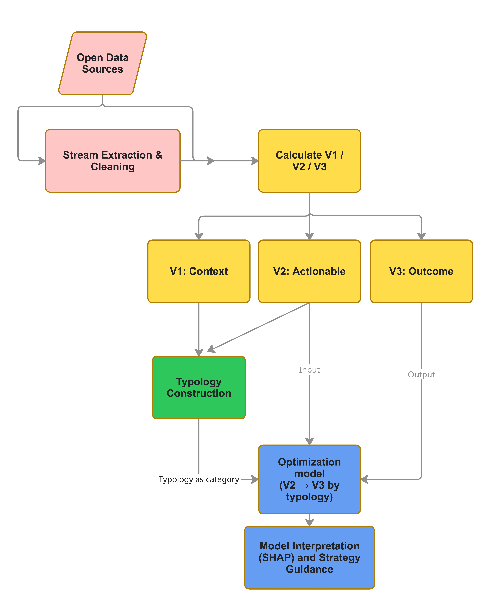
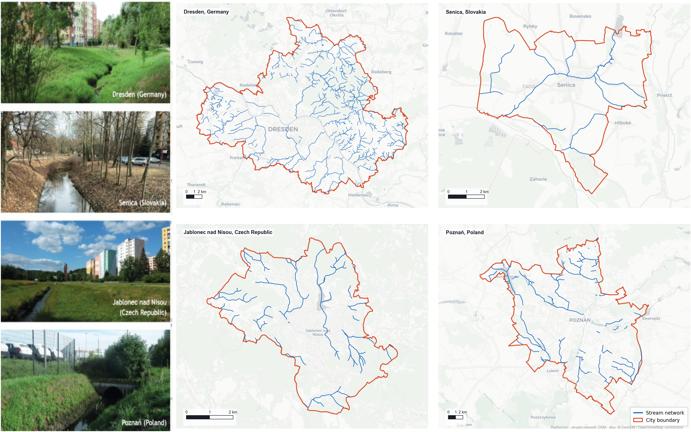
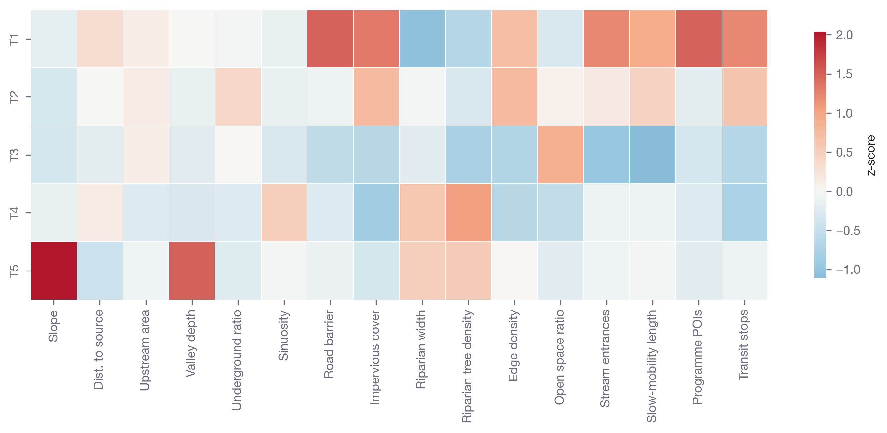
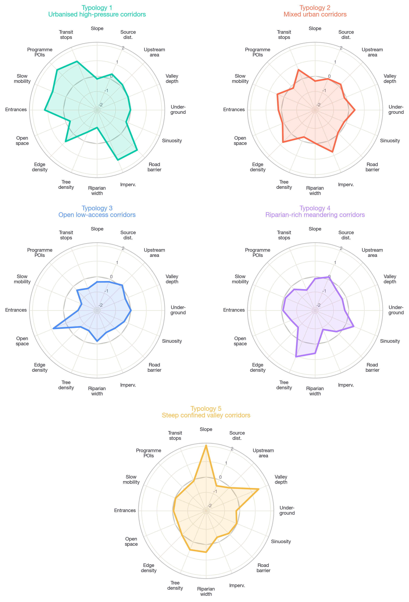
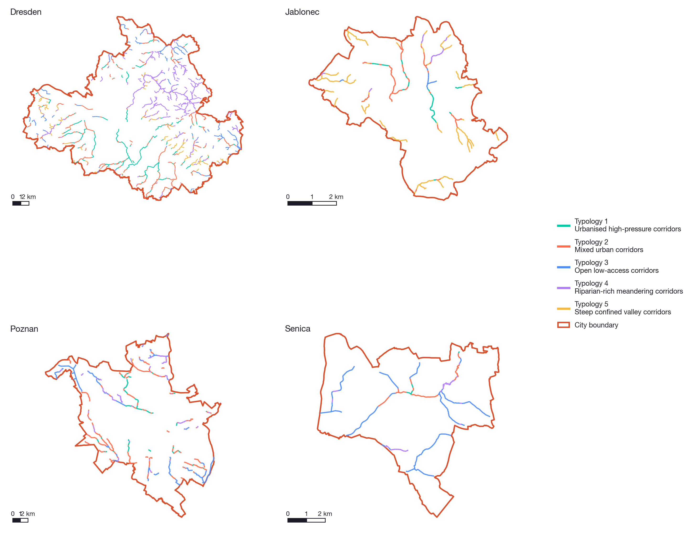
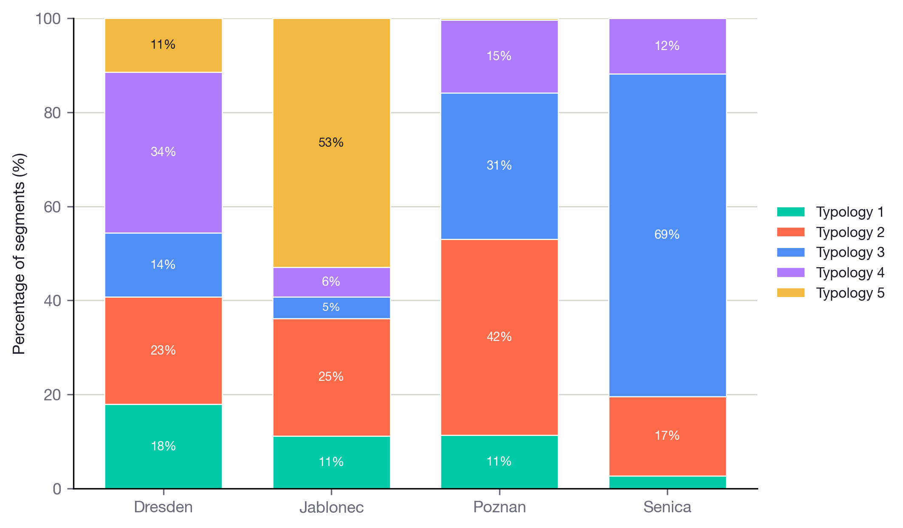
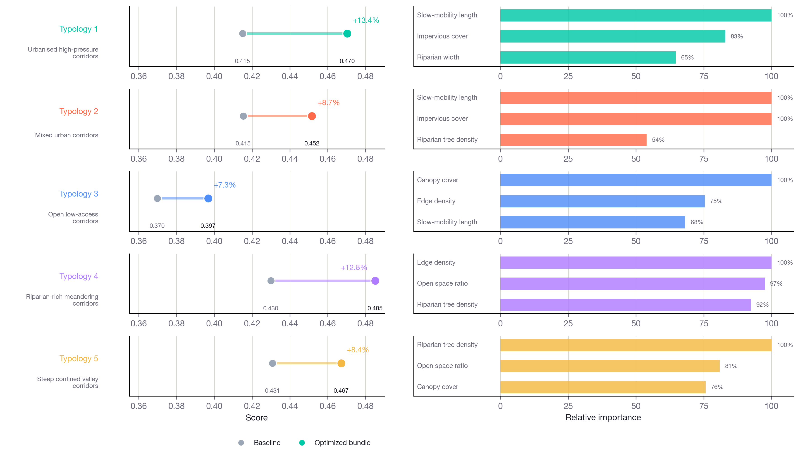

```{r}
#| label: setup-tables
#| include: false
source("table_helpers.R")
```

# Abstract

xxxxxxx

# 1. Introduction

Urban streams form extensive yet often overlooked ecological and spatial networks within cities (Paul & Meyer, 2001; Benda et al., 2004). Despite their widespread presence, many urban streams are heavily modified through channelization, culverting, and surrounding urban development, resulting in degraded ecological conditions and limited social functionality. These transformations reduce their capacity to support biodiversity, mitigate urban heat, and provide accessible public spaces. 

In the context of increasing environmental challenges, including biodiversity loss and climate change, urban streams have the potential to function as nature-based solutions that simultaneously enhance ecological performance and improve urban livability (Raymond et al., 2017; Ranta et al., 2021). However, their restoration and management remain constrained by fragmented assessment approaches. Existing evaluations are typically based on site-specific field surveys, which are time-consuming, difficult to standardize, and not scalable to large urban stream networks (Ranta et al., 2021; Lespez et al., 2025). Restoration outcomes depend not only on local reach conditions, but also on riparian structure, accessibility, and surrounding urban development (Beechie et al., 2010; Palmer et al., 2014; Wohl et al., 2015).

Recent advances in open geospatial data offer new opportunities to assess urban stream conditions at scale (Amatulli et al., 2018; Zanaga et al., 2022; Finizio et al., 2024). Nevertheless, most existing studies focus on descriptive assessments or composite indices (Ranta et al., 2021; Lespez et al., 2025), which often obscure underlying mechanisms and provide limited guidance for practical interventions. There remains a lack of workflows that can both identify restoration needs and connect spatial analysis to planning strategies (Bernhardt et al., 2005; Wohl et al., 2015). In particular, many assessment approaches do not clearly distinguish between relatively stable context conditions, variables that can be changed through intervention, and outcome variables, even though these three types of variables play different roles in restoration decision-making.

This distinction is important for urban stream planning. In this study, the stream corridor is described through three types of information: relatively stable background conditions, corridor attributes that can be influenced by planning or design, and outcome variables. Hydro-morphological and infrastructural conditions such as slope, valley confinement, upstream position, culverting, and road barriers define the context within which interventions take place (Benda et al., 2004; Xia et al., 2010; Grill et al., 2019). By contrast, variables such as impervious cover, canopy cover, riparian vegetation structure, open space, entrances, slow-mobility paths, public transport, and program access are more directly connected to planning or design action (Schiff & Benoit, 2007; Pace et al., 2022; Lespez et al., 2025). Outcome variables such as habitat quality, vegetation condition, land surface temperature, carbon storage, floodplain availability, visibility, and network-based access describe the biodiversity, climate adaptation, and quality-of-life goals that restoration seeks to improve (Aznarez et al., 2022; Zhou et al., 2023; Sharp et al., 2024).

This study emphasizes the relationships between variables that can be changed through intervention and multiple outcome variables, and seeks to provide interpretable guidance for optimizing restoration measures in urban stream corridors. The framework connects segment-scale open-data mapping, stream corridor typology, typology-specific predictive modeling, and constrained intervention optimization, while keeping the main focus on why different corridor contexts require different restoration priorities.

Therefore, the aim of this study is to develop a spatially explicit, open-data-based framework to support urban stream restoration. Specifically, it addresses the key question: for different types of stream corridors, what types of interventions are most effective to improve biodiversity, climate adaptation, and quality of life?


------------------------------------------------------------------------

# 2. Methods

## 2.1 Workflow overview

The workflow contains the following stages:

1.  Stream geometry cleaning and segmentation.
2.  Variable calculation (V1, V2, V3).
3.  Merge all variables to 100 m segment level.
4.  Clustering and interpretation.
5.  Relate V2 and V3 for each cluster to find the most effective interventions.

The analysis uses open data sources including OpenStreetMap, ESA WorldCover, Copernicus products, Landsat imagery, and GBIF records.

{#fig-workflow width="50%"}

## 2.2 Study area

The framework was applied to four Central European cities: Dresden (Germany), Poznan (Poland), Jablonec nad Nisou (Czech Republic), and Senica (Slovakia). The cities were selected as part of the Interreg CE project ReBioClim to cover different urban sizes and stream settings, from large urban floodplain systems to small mountain and lowland cities. All spatial analyses were carried out in EPSG:25833 (ETRS89 / UTM zone 33N), and the same scripts and parameter settings were used for all cities (@fig-study-area).

{#fig-study-area width="88%"}

## 2.3 Stream network extraction, pre-processing and segmentation

The stream network was extracted from OpenStreetMap using waterway tags for streams, drains, ditches, and culverts. Isolated drain and ditch segments not connected to the broader waterway network were removed. Named stream reaches were dissolved to continuous lines, and unnamed reaches were merged by proximity at a 2 m threshold in EPSG:25833. Segments shorter than 100 m after merging were excluded from the final network.

Mouth points for each stream line were detected from a 30 m digital terrain model (DTM) and used as the downstream anchor for segment generation. From each mouth, the stream was divided into 100 m, 200 m, and 400 m segments measured along the network in the upstream direction. This mouth-anchored segmentation ensures that segment boundaries are topologically consistent across scales and that upstream catchment position is directly encoded in the distance-to-source variable. The 100 m layer served as the primary unit of analysis throughout the typology and optimization stages.

## 2.4 Variable system

Variables are organized into three groups. V1 variables represent relatively stable hydro-morphological context and structural conditions. V2 variables represent intervention-related attributes of the stream corridor, including ecological characteristics and accessibility-related factors. V3 variables represent outcome variables corresponding to the three primary goals of the study: biodiversity, climate adaptation, and quality of life. The full variable list is shown in @tbl-variable-inventory.

```{r}
#| label: tbl-variable-inventory
#| tbl-cap: "Variable list."
#| echo: false
source("table_helpers.R")
paper_table_width("tables/variable_inventory.csv", c(1.0, 2.0, 0.5, 2.0, 0.8))
```

V1 variables define the underlying physical and spatial constraints within which stream corridor interventions take place. They include slope, valley depth, distance to source, upstream catchment area, sinuosity, road barrier intensity, and underground ratio. Valley depth was derived from DTM-based valley polygons using rcrisp (Forgaci & Nattino, 2025a), upstream area was calculated from DTM flow accumulation using pysheds (Bartos, 2020), and underground ratio was derived from OSM culvert and underground stream information.

V2 variables describe conditions that can more directly be influenced through intervention. They include impervious cover, canopy cover, riparian width, riparian continuity, riparian tree density, edge density, open space ratio, entrance count, slow-mobility path length, program-related POIs, and public transport stops.

V3 variables describe outcome conditions. Biodiversity variables include InVEST habitat quality, land-cover diversity, riparian NDVI, and GBIF species richness. Climate adaptation variables include carbon storage, land surface temperature, and floodplain availability. Quality-of-life variables include visibility, access to building origins, access to public transport, and access to program-related POIs from stream entry points.

## 2.5 Stream corridor typology

K-means clustering was performed on the merged 100 m dataset. Standardization was applied before clustering, and the final cluster assignment was joined back to the segment geometry. Clustering is based on the combined V1 and V2 variable set, so the typology captures both relatively stable corridor context and current intervention-related conditions.

Different clustering algorithms were tested during the workflow, including k-means, Ward hierarchical clustering, GMM, DBSCAN, and HDBSCAN. The final typology uses k-means clustering. The number of clusters was evaluated using silhouette score, Calinski-Harabasz index, Davies-Bouldin index, and interpretability of the resulting profiles. A five-cluster solution was selected for the final typology.

## 2.6 Optimization model

### 2.6.1 Overall outcome score

All V3 variables were first directionally harmonized so that higher values indicate better performance. Land surface temperature was inverted, while the other variables were kept in their original direction. Each variable was min-max normalized to \[0, 1\], and the overall V3 score was calculated as the unweighted mean of the available V3 variables. This score is used as the prediction target for the models and as the objective for the optimization.

### 2.6.2 Predictive model

For each cluster, an XGBoost regression model (Chen & Guestrin, 2016) with 5-fold cross-validation was applied to quantify the contribution of individual V2 variables to the overall V3 score. The cluster-specific models identify context-dependent effects, where the effectiveness of interventions may vary across different structural conditions.

### 2.6.3 SHAP interpretation

This step identifies which V2 variables are most closely associated with the outcome score within each typology. Feature importance and SHAP values (Lundberg & Lee, 2017) are used to interpret model results and to understand both the relative importance of variables and their directional effects on outcomes.

### 2.6.4 Constrained optimization

For each type, the five highest-ranked V2 variables from the SHAP analysis were used as the optimization variables. An exhaustive grid search tested combinations of feasible changes from the cluster-mean baseline, such as reducing impervious cover, increasing canopy cover, or increasing slow-mobility path length within predefined bounds. The combination with the highest predicted V3 score was reported as the optimal intervention scenario for that type.

This modeling step links spatial patterns with restoration guidance.

------------------------------------------------------------------------

# 3. Results

## 3.1 Variable outputs

Summary statistics of the typology input variables are presented in @tbl-variable-summary. The dataset covers 5,886 100-meter segments, of which 4,712 have complete records for all 16 typology input variables (80.1%). The largest source of missingness among the V1 variables is valley depth, attributable to segments where the DTM-derived valley polygon does not intersect the segment geometry, typically in culverted or buried urban reaches.

These summary statistics also indicate the range of intervention conditions represented in the dataset, from highly sealed and accessible urban corridors to more open or riparian-rich reaches.

```{r}
#| label: tbl-variable-summary
#| tbl-cap: "Typology input variable summary."
#| echo: false
source("table_helpers.R")
paper_variable_summary("tables/variable_summary.csv")
```

## 3.2 Stream corridor typology

### 3.2.1 Classification performance

The k = 5 classification was fitted on 4,712 complete-row segments using 16 standardized V1 and V2 variables (@tbl-typology-model-summary). Cluster sizes range from 511 to 1,268 segments, indicating a well-distributed classification without very small clusters (@tbl-typology-cluster-sizes). The silhouette coefficient of 0.141 is consistent with values reported for cluster analyses of complex urban landscape data, where overlapping gradients make clear cluster boundaries unlikely. The Calinski-Harabasz score of 621.5 indicates inter-cluster separation relative to within-cluster variance.

```{r}
#| label: tbl-typology-model-summary
#| tbl-cap: "Typology model summary."
#| echo: false
source("table_helpers.R")
paper_table("tables/typology_model_summary.csv")
```

```{r}
#| label: tbl-typology-cluster-sizes
#| tbl-cap: "Typology cluster sizes."
#| echo: false
source("table_helpers.R")
paper_table("tables/typology_cluster_sizes.csv")
```

### 3.2.2 Typology profiles

The typology profiles are summarized in original units (@tbl-typology-profile-original) and visualized as a profile heatmap (@fig-typology-heatmap) and radar profiles (@fig-typology-radar). The results suggest five corridor types.

**Typology 1: Urbanized high-pressure corridors** (n = 708; 15.0%). These corridors have high surrounding urban pressure, with high impervious cover, high road barrier intensity, many stream entrances, extensive slow-mobility infrastructure, and many program-related POIs. At the same time, riparian width and riparian tree density are low, indicating narrow and weakly vegetated buffers.

**Typology 2: Mixed urban corridors** (n = 1,268; 26.9%). These corridors represent an intermediate urban condition. Impervious cover, slow-mobility supply, land-cover edge density, and underground ratio are higher than in the more natural types, but riparian conditions are not as poor as in Typology 1. This suggests corridors with partial urbanization and some remaining vegetation structure.

**Typology 3: Open low-access corridors** (n = 966; 20.5%). These corridors have low impervious cover and a high open space ratio, suggesting relatively low built-up pressure around the stream. However, entrance count, slow-mobility supply, and program-related POIs are low. They therefore appear to be open or peri-urban corridors with available space, but limited public accessibility.

**Typology 4: Riparian-rich meandering corridors** (n = 1,259; 26.7%). These corridors are characterized by higher sinuosity, wider riparian zones, and higher riparian tree density. Impervious cover and road barrier intensity are low, indicating comparatively low infrastructure pressure and stronger riparian structure.

**Typology 5: Steep confined valley corridors** (n = 511; 10.8%). These corridors are defined mainly by steep slopes, deeper valleys, and shorter distance to source. They represent upper-network or confined valley settings. Riparian structure is moderate, and accessibility metrics are close to the dataset average.

```{r}
#| label: tbl-typology-profile-original
#| tbl-cap: "Typology profiles."
#| echo: false
source("table_helpers.R")
paper_table_width("tables/typology_profile_original.csv", c(0.6, rep(0.55, 16)))
```

{#fig-typology-heatmap width="92%"}

{#fig-typology-radar width="92%"}

### 3.2.3 Spatial distribution across cities

The typology assignment is not evenly distributed across the four study cities (@fig-typology-spatial; @fig-typology-by-city). Dresden and Poznan show a higher percentage of Types 1 and 2 in central and peri-urban corridors, whereas Jablonec nad Nisou is dominated by Type 5 in its steep valley network and Type 4 along more sinuous forested reaches. Senica presents a more even mix of open low-access and riparian-rich corridors across its low-gradient agricultural setting. The spatial maps show that typology membership follows recognizable geomorphological and land-use patterns within each city, instead of arbitrary spatial fragmentation.

{#fig-typology-spatial width="92%"}

{#fig-typology-by-city width="78%"}

## 3.3 Intervention effectiveness

The intervention analysis evaluates whether the same V2 variables explain overall V3 performance across all typologies, or whether different corridor contexts point to different priority variables.

### 3.3.1 Overall V3 performance by type

The overall V3 performance score varies across typology clusters, reflecting systematic differences in ecological and social conditions associated with different stream corridor contexts (@fig-v3-boxplot). Typology 5 has the highest cluster-mean modeled baseline score, while Typology 3 records the lowest baseline score, indicating the weakest aggregate performance across the available biodiversity, climate adaptation, and quality-of-life variables. Typologies 1, 2, and 4 lie at intermediate values, with differing within-typology variance structures: Typology 1 shows the widest spread, reflecting its range from high-pressure central corridors to accessible greenway segments, while Typology 4 exhibits the most compact distribution, consistent with more uniform riparian-natural conditions.

The domain decomposition of the overall score shows that biodiversity variables are highest in Typologies 4 and 5, while public slow-mobility access, public transport access, and program access are highest in Typologies 1 and 2. The corridor types with the best current ecological conditions also have the poorest social accessibility, and vice versa, confirming the multi-objective nature of urban stream restoration.

{#fig-v3-boxplot}

### 3.3.2 Context-dependency of intervention priorities

Cluster-specific SHAP values show that intervention priorities differ strongly across typologies and do not follow a single uniform ranking (@tbl-shap-top-levers; @fig-intervention-summary). In Typologies 1 and 2, slow-mobility pathway length and impervious cover have the highest mean absolute SHAP values, indicating that both mobility infrastructure and surface sealing are important in accessible but ecologically stressed urban corridors.

In contrast, Typology 3 is led by canopy cover, followed by land-cover edge density, suggesting that in low-pressure, open corridors, the main limitation is the lack of tree canopy, not surface sealing. Typology 4 is led by edge density and open space ratio, while Typology 5 is led by riparian tree density, pointing to vegetation structure as the main constraint in already near-natural corridors.

This pattern shows that impervious surface reduction is most relevant in urbanized types. In more rural or forested contexts, vegetation structure and open space are more closely related to overall performance.

```{r}
#| label: tbl-shap-top-levers
#| tbl-cap: "Top SHAP variables by typology."
#| echo: false
source("table_helpers.R")
paper_table("tables/shap_top_levers.csv")
```

### 3.3.3 Optimal intervention scenarios per typology

For each typology cluster, constrained optimization identifies the combination of V2 interventions that maximizes the predicted overall V3 gain relative to the cluster-mean baseline (@tbl-intervention-results; @fig-intervention-summary). Under joint optimization of the five highest-ranked variables per typology, achievable gains range from 7.3% in Typology 3 to 13.4% in Typology 1.

The optimal intervention sets differ across typologies. In Typology 1, the optimal set combines a large increase in slow-mobility path supply, impervious cover reduction, and riparian width expansion. Slow-mobility expansion and surface de-sealing address the main social and ecological constraints in this type. Typology 2 shows a similar structure with smaller magnitudes. Typology 3 prioritizes canopy cover gain and slow-mobility expansion, with impervious cover reduction absent from the top priorities, reflecting the low impervious baseline. Typologies 4 and 5 prioritize riparian tree density, open space ratio, and canopy cover, with smaller magnitudes reflecting the already-high ecological performance baseline. These differences support typology-specific intervention design instead of applying the same restoration strategy across the whole stream network.

```{r}
#| label: tbl-intervention-results
#| tbl-cap: "Optimized intervention scenarios."
#| echo: false
source("table_helpers.R")
paper_table("tables/intervention_results.csv")
```

{#fig-intervention-summary width="96%"}

------------------------------------------------------------------------

# 4. Discussion

## 4.1 Typology-based design implications

The results show that urban stream restoration should account for corridor context. The five typologies do not simply describe different levels of degradation; they represent different combinations of geomorphological setting, urban pressure, riparian structure, and public accessibility. The same intervention variable can be important in one typology and less relevant in another.

For Urbanized high-pressure corridors and Mixed urban corridors, ecological improvement and public access need to be considered together. These types combine high impervious cover, road barrier intensity, entrances, slow-mobility supply, and program access with weaker riparian structure. The optimization results point toward sets of interventions that combine surface de-sealing, riparian widening, and mobility-network improvement. In practical terms, these corridors are likely to benefit from blue-green restoration that is coordinated with public-space redesign and active-mobility infrastructure.

For Open low-access corridors, the main constraint is different. These segments have relatively low impervious pressure and high open space availability, but weak entrance provision, slow-mobility supply, and program access. In these settings, restoration priorities should focus less on removing urban pressure and more on improving access and ecological function in available open space. Canopy expansion, path connection, and selective programming can increase both environmental performance and everyday usability without assuming that all low-pressure corridors are already high-performing.

For Riparian-rich meandering corridors and Steep confined valley corridors, the priority is more conservative. These types already contain stronger riparian structure or distinct geomorphological constraints, so intensive public-space intervention is not always appropriate. Instead, interventions should protect existing vegetation structure, avoid fragmentation, and improve access only where it does not undermine habitat quality or slope-sensitive conditions. This supports a differentiated restoration strategy in which some corridors are prioritized for active urban integration while others are managed primarily for ecological continuity and protection.

Across all typologies, the main contribution of the framework is to show that restoration priorities depend on the type of corridor being considered. The typology, SHAP interpretation, and constrained optimization together provide a way to identify where intervention effort is likely to improve multiple outcomes.

## 4.2 Limitations and future work

Several limitations remain in the present analysis. First, GBIF species richness is a citizen science proxy that conflates ecological quality with observer effort. The strong inter-city variation in GBIF record density means that the biodiversity component of the overall score partially reflects sampling effort rather than ecological quality alone. Future work should include corrections or replace citizen science data with standardized bioassessment records where available.

Second, the overall V3 score assigns equal weight to each outcome domain. A corridor with very high biodiversity performance and very low quality of life receives the same overall score as one with intermediate performance in both domains. Domain-weighted or Pareto-optimal approaches could be implemented to support value-explicit planning processes.

Finally, the study covers four Central European cities spanning a limited range of climatic and urban morphological contexts. Testing the typology and variable-outcome relationships in Mediterranean, Nordic, or non-European contexts would show how far the results can be generalized.

------------------------------------------------------------------------

# 5. Conclusion

Using an open-data framework applied to 5,886 stream segments across four Central European cities, five structurally distinct corridor types were identified from openly available geospatial data. The effectiveness of restoration variables varied across these types, and constrained multi-objective optimization identified feasible sets of interventions that improve biodiversity, climate adaptation, and quality-of-life outcomes within each type. Predicted overall performance gains of 7 to 13% under planning-realistic variable changes show that all five corridor types still have room for improvement, with the greatest gains available in the most urbanized and ecologically stressed corridors.

The framework provides municipal planners, urban ecologists, and urban designers with a way to target and prioritize stream restoration investment. By aligning interventions with corridor context, cities can improve the ecological and social returns from limited restoration budgets while building connected stream networks for biodiversity and climate adaptation.

The broader value of the approach is that urban stream restoration can be assessed at the network scale while still keeping intervention priorities specific to each corridor type.

------------------------------------------------------------------------

# References

Amatulli, G., Domisch, S., Tuanmu, M. N., Parmentier, B., Ranipeta, A., Malczyk, J., & Jetz, W. (2018). A suite of global, cross-scale topographic variables for environmental and biodiversity modeling. *Scientific Data, 5*(1), Article 180040. https://doi.org/10.1038/sdata.2018.40

Aznarez, C., Svenning, J. C., Taveira, G., Baró, F., & Pascual, U. (2022). Wildness and habitat quality drive spatial patterns of urban biodiversity. *Landscape and Urban Planning, 228*, Article 104570. https://doi.org/10.1016/j.landurbplan.2022.104570

Barrington-Leigh, C., & Millard-Ball, A. (2017). The world's user-generated road map is more than 80% complete. *PLOS ONE, 12*(8), Article e0180698. https://doi.org/10.1371/journal.pone.0180698

Bartos, M. (2020). *pysheds: Simple and fast watershed delineation in python* [Software]. Zenodo. https://doi.org/10.5281/zenodo.3822494

Benda, L., Poff, N. L., Miller, D., Dunne, T., Reeves, G., Pess, G., & Pollock, M. (2004). The network dynamics hypothesis: How channel networks structure riverine habitats. *BioScience, 54*(5), 413-427.

Beechie, T. J., Sear, D. A., Olden, J. D., Pess, G. R., Buffington, J. M., Moir, H., Roni, P., & Pollock, M. M. (2010). Process-based principles for restoring river ecosystems. *BioScience, 60*(3), 209-222. https://doi.org/10.1525/bio.2010.60.3.7

Bernhardt, E. S., Palmer, M. A., Allan, J. D., Alexander, G., Barnas, K., Brooks, S., Carr, J., Clayton, S., Dahm, C., Follstad-Shah, J., Galat, D., Gloss, S., Goodwin, P., Hart, D., Hassett, B., Jenkinson, R., Katz, S., Kondolf, G. M., Lake, P. S., ... Sudduth, E. (2005). Synthesizing U.S. river restoration efforts. *Science, 308*(5722), 636-637. https://doi.org/10.1126/science.1109769

Burrell, T. H., O'Neal, B., Arscott, D. B., & Newbold, J. D. (2014). Streamside forest buffer width needed to protect stream water quality, habitat, and organisms: A literature review. *JAWRA Journal of the American Water Resources Association, 50*(1), 16-39.

Chen, T., & Guestrin, C. (2016). XGBoost: A scalable tree boosting system. In *Proceedings of the 22nd ACM SIGKDD International Conference on Knowledge Discovery and Data Mining* (pp. 785-794). Association for Computing Machinery. https://doi.org/10.1145/2939672.2939785

Doretto, A., Piano, E., & Larson, C. E. (2020). The river continuum concept: Lessons from the past and perspectives for the future. *Canadian Journal of Fisheries and Aquatic Sciences, 77*(11), 1853-1864.

Ewing, R., & Cervero, R. (2010). Travel and the built environment: A meta-analysis. *Journal of the American Planning Association, 76*(3), 265-294. https://doi.org/10.1080/01944361003766766

Finizio, M., Pontieri, F., Bottaro, C., Di Febbraro, M., Innangi, M., Sona, G., & Carranza, M. L. (2024). Remote sensing for urban biodiversity: A review and meta-analysis. *Remote Sensing, 16*(23), Article 4483. https://doi.org/10.3390/rs16234483

Foley, J. A., DeFries, R., Asner, G. P., Barford, C., Bonan, G., Carpenter, S. R., & Snyder, P. K. (2005). Global consequences of land use. *Science, 309*(5734), 570-574. https://doi.org/10.1126/science.1111772

Forgaci, C., & Nattino, F. (2025a). *rcrisp: Automate the delineation of urban river spaces* [Software]. Zenodo. https://doi.org/10.5281/zenodo.15793526

Forgaci, C., & Nattino, F. (2025b). *visor: Geospatial tools for visibility analysis* [Software]. Zenodo. https://doi.org/10.5281/zenodo.15133420

Forman, R. T. T., & Alexander, L. E. (1998). Roads and their major ecological effects. *Annual Review of Ecology and Systematics, 29*, 207-231.

Geurs, K. T., & van Wee, B. (2004). Accessibility evaluation of land-use and transport strategies: Review and research directions. *Journal of Transport Geography, 12*(2), 127-140. https://doi.org/10.1016/j.jtrangeo.2003.10.005

Gregory, K. J., Davis, R. J., & Downs, P. W. (1992). Identification of river channel change due to urbanisation. *Applied Geography, 12*(4), 299-318.

Grill, G., Lehner, B., Thieme, M., Geenen, B., Tickner, D., Antonelli, F., Babu, S., & Zarfl, C. (2019). Mapping the world's free-flowing rivers. *Nature, 569*, 215-221. https://doi.org/10.1038/s41586-019-1111-9

Hall, L. S., Krausman, P. R., & Morrison, M. L. (1997). The habitat concept and a plea for standard terminology. *Wildlife Society Bulletin, 25*(1), 173-182.

Hislop, S., Soto-Berelov, M., Jellinek, S., Chee, Y. E., & Jones, S. (2025). Monitoring riparian vegetation in urban areas with Sentinel-2 satellite imagery. *Ecological Management & Restoration*.

IPCC. (2019). *2019 refinement to the 2006 IPCC guidelines for national greenhouse gas inventories: Volume 4. Agriculture, forestry and other land use*. IPCC.

Jaeger, J. A. G. (2000). Landscape division, splitting index, and effective mesh size: New measures of landscape fragmentation. *Landscape Ecology, 15*(2), 115-130. https://doi.org/10.1023/A:1008129329289

Jones, R. J. A., Hiederer, R., Rusco, E., & Montanarella, L. (2005). Estimating organic carbon in the soils of Europe for policy support. *European Journal of Soil Science, 56*(5), 655-671. https://doi.org/10.1111/j.1365-2389.2005.00728.x

Kim, Y. H., & Baik, J. J. (2008). Maximum urban heat island intensity in Seoul. *Journal of Applied Meteorology and Climatology, 47*(3), 651-659. https://doi.org/10.1175/2007JAMC1638.1

Leopold, L. B., & Maddock, T. (1953). *The hydraulic geometry of stream channels and some physiographic implications* (U.S. Geological Survey Professional Paper 252). U.S. Geological Survey.

Lespez, L., Germaine, M. A., Gob, F., Tales, E., Thommeret, N., de Milleville, L., & Letourneur, M. (2025). A new tool to characterise the socio-environmental dimensions of urban rivers: Urban river socio-environmental index. *Landscape and Urban Planning, 261*, Article 105388. https://doi.org/10.1016/j.landurbplan.2025.105388

Lundberg, S. M., & Lee, S.-I. (2017). A unified approach to interpreting model predictions. In *Advances in Neural Information Processing Systems* (Vol. 30). Curran Associates.

Niezgoda, S. L., & Johnson, P. A. (2005). Improving the urban stream restoration effort: Identifying critical form and processes relationships. *Environmental Management, 35*(5), 579-592.

Nobre, A. D., Cuartas, L. A., Hodnett, M., Renno, C. D., Rodrigues, G., Silveira, A., & Waterloo, M. (2016). HAND contour: A new proxy predictor of inundation extent and related water depth. *Geophysical Research Letters, 43*(18), 9723-9731. https://doi.org/10.1002/2016GL069050

Pace, B. A., Kolka, R. K., & Palik, B. J. (2022). Applying the Goldilocks rule to riparian buffer widths for forested headwater streams across the contiguous U.S. *Forests, 13*(9), Article 1509. https://doi.org/10.3390/f13091509

Pan, Y., Birdsey, R. A., Fang, J., Houghton, R., Kauppi, P. E., Kurz, W. A., & Hayes, D. (2011). A large and persistent carbon sink in the world's forests. *Science, 333*(6045), 988-993. https://doi.org/10.1126/science.1201609

Palmer, M. A., Bernhardt, E. S., Allan, J. D., Lake, P. S., Alexander, G., Brooks, S., Carr, J., Clayton, S., Dahm, C. N., Follstad-Shah, J., Galat, D. L., Loss, S. G., Goodwin, P., Hart, D. D., Hassett, B., Jenkinson, R., Kondolf, G. M., Lave, R., Meyer, J. L., ... Sudduth, E. (2005). Standards for ecologically successful river restoration. *Journal of Applied Ecology, 42*(2), 208-217. https://doi.org/10.1111/j.1365-2664.2005.01004.x

Palmer, M. A., Hondula, K. L., & Koch, B. J. (2014). Ecological restoration of streams and rivers: Shifting strategies and shifting goals. *Annual Review of Ecology, Evolution, and Systematics, 45*, 247-269. https://doi.org/10.1146/annurev-ecolsys-120213-091935

Paul, M. J., & Meyer, J. L. (2001). Streams in the urban landscape. *Annual Review of Ecology and Systematics, 32*, 333-365. https://doi.org/10.1146/annurev.ecolsys.32.081501.114040

Polasky, S., Nelson, E., Pennington, D., & Johnson, K. A. (2011). The impact of land-use change on ecosystem services, biodiversity and returns to landowners: A case study in Minnesota. *Environmental and Resource Economics, 48*(2), 219-242. https://doi.org/10.1007/s10640-010-9407-0

Ranta, E., Vidal-Abarca, M. R., Calapez, A. R., & Feio, M. J. (2021). Urban stream assessment system (UsAs): An integrative tool to assess biodiversity, ecosystem functions and services. *Ecological Indicators, 121*, Article 106980. https://doi.org/10.1016/j.ecolind.2020.106980

Raymond, C. M., Frantzeskaki, N., Kabisch, N., Berry, P., Breil, M., Nita, M. R., Geneletti, D., & Calfapietra, C. (2017). A framework for assessing and implementing the co-benefits of nature-based solutions in urban areas. *Environmental Science & Policy, 77*, 15-24. https://doi.org/10.1016/j.envsci.2017.07.008

Rigolon, A. (2016). A complex landscape of inequity in access to urban parks: A literature review. *Landscape and Urban Planning, 153*, 160-169. https://doi.org/10.1016/j.landurbplan.2016.05.017

Rosgen, D. L. (1994). A classification of natural rivers. *Catena, 22*(3), 169-199.

Saelens, B. E., Sallis, J. F., & Frank, L. D. (2003). Environmental correlates of walking and cycling: Findings from the transportation, urban design, and planning literatures. *Annals of Behavioral Medicine, 25*(2), 80-91. https://doi.org/10.1207/S15324796ABM2502_03

Sallustio, L., De Toni, A., Strollo, A., Di Febbraro, M., Gissi, E., Casella, L., & Munafa, M. (2017). Assessing habitat quality in relation to the spatial distribution of protected areas in Italy. *Journal of Environmental Management, 201*, 129-137. https://doi.org/10.1016/j.jenvman.2017.06.031

Schiff, R., & Benoit, G. (2007). Effects of impervious cover at multiple spatial scales on coastal watershed streams. *JAWRA Journal of the American Water Resources Association, 43*(3), 712-730.

Sharma, S., & Khanal, P. (2024). Assessing land-cover change and urbanization impact on riparian zones in South Carolina: A decade of transition. *Land, 13*(12), Article 2232. https://doi.org/10.3390/land13122232

Sharp, R., Chaplin-Kramer, R., Wood, S., Guerry, A., Tallis, H., & Ricketts, T. (2024). *InVEST 3.19 user's guide*. The Natural Capital Project, Stanford University.

Terrado, M., Sabater, S., Chaplin-Kramer, B., Mandle, L., Ziv, G., & Acuna, V. (2016). Model development for the assessment of terrestrial and aquatic habitat quality in conservation planning. *Science of the Total Environment, 540*, 63-70. https://doi.org/10.1016/j.scitotenv.2015.03.064

Verol, M. P., de Melo, D. C., & Miguez, M. G. (2019). Uncertainty in flood hazard map based on HAND physical model: The influence of DEM resolution. *Natural Hazards, 96*, 1235-1252.

Vietz, G. J., Walsh, C. J., & Fletcher, T. D. (2016). Urban hydrogeomorphology and the urban stream syndrome: Treating the symptoms and causes of geomorphic change. *Progress in Physical Geography, 40*(3), 480-492. https://doi.org/10.1177/0309133315605048

Walsh, C. J., Roy, A. H., Feminella, J. W., Cottingham, P. D., Groffman, P. M., & Morgan, R. P. (2005). The urban stream syndrome: Current knowledge and the search for a cure. *Journal of the North American Benthological Society, 24*(3), 706-723. https://doi.org/10.1899/04-028.1

Wohl, E., Lane, S. N., & Wilcox, A. C. (2015). The science and practice of river restoration. *Water Resources Research, 51*(8), 5974-5997. https://doi.org/10.1002/2014WR016874

Xia, T., Zhu, W., Xin, P., & Li, L. (2010). Assessment of urban stream morphology: An integrated index and modelling system. *Environmental Monitoring and Assessment, 167*(1), 447-460.

Zanaga, D., Van De Kerchove, R., De Keersmaecker, W., Souverijns, N., Brockmann, C., Quast, R., & Arino, O. (2022). *ESA WorldCover 10 m 2021 v200* [Data set]. Zenodo. https://doi.org/10.5281/zenodo.7254221

Zhou, W., Cao, W., Wu, T., & Zhang, T. (2023). The win-win interaction between integrated blue and green space on urban cooling. *Science of the Total Environment, 863*, Article 160712. https://doi.org/10.1016/j.scitotenv.2022.160712
